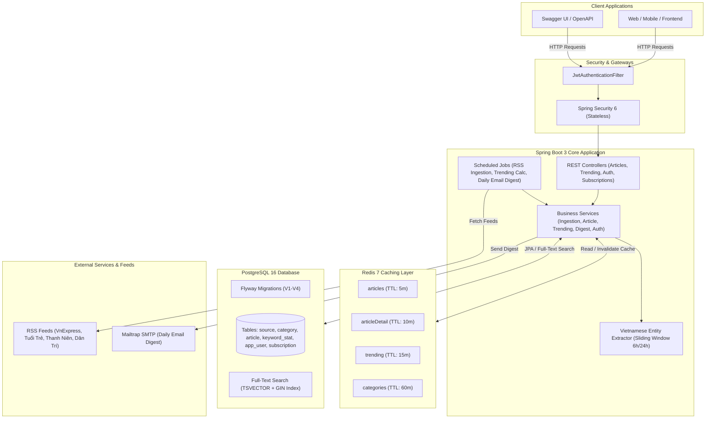

# 📰 News Aggregator & Tracker Backend

[](https://openjdk.org/)
[](https://spring.io/projects/spring-boot)
[](https://www.postgresql.org/)
[](https://redis.io/)
[](https://www.docker.com/)
[](https://github.com/tuankhanh2306/News-Aggregator-Tracker/actions)
[](http://localhost:8080/swagger-ui/index.html)
[](LICENSE)

Hệ thống Backend tổng hợp, chuẩn hóa và theo dõi tin tức tự động đa nguồn (News Aggregator & Tracker) xây dựng theo kiến trúc chuẩn doanh nghiệp với **Java 21**, **Spring Boot 3.4.3**, **PostgreSQL 16**, **Redis 7** và **Docker**.

Dự án mô phỏng trọn vẹn luồng xử lý dữ liệu thực tế: thu thập RSS định kỳ, cô lập lỗi đa luồng, loại bỏ trùng lặp bằng hàm băm SHA-256, tìm kiếm toàn văn Full-Text Search (TSVECTOR), đệm dữ liệu Redis Cache đa tầng (tăng tốc độ phản hồi gấp ~10 lần), trích xuất từ khóa/thực thể xu hướng (Trending Entities), xác thực Stateless JWT và lập lịch gửi bản tin tóm tắt hằng ngày qua Email HTML.

---

## 🏛️ 1. Sơ đồ Kiến trúc Hệ thống (Architecture Diagram)



---

## ⚡ 2. Các Quyết định Kỹ thuật Nổi bật (Key Engineering Decisions)

| Hạng mục | Vấn đề thực tế | Giải pháp kỹ thuật lựa chọn | Lý do & Lợi ích |
|---|---|---|---|
| **Chống trùng lặp tin tức** | URL bài viết có thể rất dài, query so sánh string trên toàn bảng gây chậm (O(N)). | Hash URL bằng **SHA-256** thành chuỗi `CHAR(64)`, đánh chỉ mục `UNIQUE INDEX`. | Kiểm tra trùng lặp chỉ mất $O(1)$, tiết kiệm bộ nhớ chỉ mục tối đa. |
| **Cô lập lỗi Ingestion** | 1 nguồn RSS bị sập/chết mạng có thể làm hỏng toàn bộ mẻ crawl của các nguồn khác. | Khối `try-catch` độc lập cho từng RSS Source trong vòng lặp batch. | Hệ thống luôn đảm bảo tính sẵn sàng cao (High Availability), ghi nhận chi tiết số tin thành công/thất bại. |
| **Tìm kiếm toàn văn (Search)** | Tìm kiếm bằng `LIKE '%keyword%'` gây Full Table Scan, không hiểu dấu tiếng Việt, không sắp xếp được theo độ liên quan. | **PostgreSQL TSVECTOR + GIN Index**, hàm `ts_rank` trọng số 'A' cho tiêu đề và 'B' cho tóm tắt. | Tìm kiếm cực nhanh, hỗ trợ xếp hạng bài viết theo độ liên quan mà không cần dựng cụm Elasticsearch phức tạp. |
| **Tối ưu hóa Cache** | Dữ liệu tin tức được đọc liên tục, truy vấn trực tiếp vào DB gây tắc nghẽn connection pool. | **Redis Cache đa tầng** với TTL tùy biến (`articles`: 5m, `trending`: 15m, `categories`: 60m) + Cache Eviction khi có tin mới. | Tốc độ phản hồi API giảm từ **~491ms xuống ~50ms (nhanh gấp ~10 lần)**. |
| **Trích xuất Thực thể Xu hướng** | Tiếng Việt là ngôn ngữ đơn lập, tách từ đơn lẻ khiến các từ như "Việt", "Nam", "Thái" gây loãng bảng xu hướng. | Regex nhận diện cụm danh từ riêng viết hoa 2-3 từ (`"Việt Nam"`, `"Thái Lan"`, `"FIFA ASEAN Cup"`) và từ viết tắt (`"USD"`, `"AI"`), kết hợp bộ stop words mở rộng và sliding window. | Bảng từ khóa xu hướng phản ánh chính xác các sự kiện, nhân vật, tổ chức nóng hổi trong 6h-24h qua. |
| **Loại bỏ N+1 Query** | Tải danh sách bài viết hoặc subscription kèm đối tượng liên quan (Category, Source) sinh ra hàng chục câu query phụ. | Sử dụng **`@EntityGraph`** và **`JOIN FETCH`** của Spring Data JPA. | Truy vấn toàn bộ quan hệ cần thiết chỉ trong **1 câu SQL duy nhất**. |
| **Xác thực Hệ thống** | Cần hỗ trợ kiến trúc mở rộng theo chiều ngang (Horizontal Scaling) đằng sau Load Balancer. | **Spring Security 6 + JJWT 0.12 (Stateless)**, mật khẩu băm chuẩn **BCrypt**. | Server không lưu session vào RAM, tăng tối đa khả năng mở rộng. |
| **Kiểm thử Tích hợp** | Mock Database bằng H2 in-memory không hỗ trợ kiểu dữ liệu `TSVECTOR` và trigger của PostgreSQL. | **Testcontainers**: Tự động bật container Docker PostgreSQL thật trong quá trình kiểm thử. | Đảm bảo 100% tính tương thích giữa môi trường test và môi trường production thật. |

---

## 🛠️ 3. Công nghệ Sử dụng (Tech Stack)

- **Ngôn ngữ & Nền tảng:** Java 21 (LTS), Spring Boot 3.4.3
- **Cơ sở dữ liệu:** PostgreSQL 16 (Full-Text Search với `TSVECTOR` & `GIN Index`), Flyway Migration (V1 đến V4)
- **Caching:** Redis 7 (Spring Cache Abstraction, Custom TTLs, Event-driven Eviction)
- **Bảo mật:** Spring Security 6, JJWT 0.12.6 (HMAC-SHA256, Stateless Bearer Token), BCrypt Password Encoder
- **Xử lý RSS:** Rome Tools 2.1.0
- **Email:** JavaMailSender, Thymeleaf Template Engine (tương thích Mailtrap)
- **Tài liệu hóa API:** SpringDoc OpenAPI 3.1 & Swagger UI 2.8.5
- **Kiểm thử:** JUnit 5, Mockito, Spring MVC Test, Testcontainers (PostgreSQL 16)
- **DevOps & CI/CD:** Docker, Docker Compose, Multi-stage Dockerfile, GitHub Actions (`ci.yml`, `cd.yml`)

---

## 🚀 4. Hướng dẫn Khởi chạy Nhanh (Quick Start)

### Yêu cầu môi trường:
- Java 21 trở lên
- Docker & Docker Compose
- Git

### Bước 1: Clone repository
```bash
git clone https://github.com/tuankhanh2306/News-Aggregator-Tracker.git
cd News-Aggregator-Tracker
```

### Bước 2: Khởi động Database & Cache qua Docker Compose
```bash
docker compose up -d
```
*Lệnh trên sẽ khởi chạy PostgreSQL 16 trên port `5432` và Redis 7 trên port `6379` với volume lưu trữ độc lập.*

### Bước 3: Chạy ứng dụng Spring Boot
```bash
# Trên Windows
.\mvnw.cmd spring-boot:run

# Trên Linux / macOS
chmod +x mvnw
./mvnw spring-boot:run
```
Ứng dụng sẽ tự động kích hoạt **Flyway Migration** (tạo toàn bộ schema V1-V4), seed các danh mục/nguồn tin mẫu và bắt đầu job nạp tin tức RSS.

### Bước 4: Truy cập Swagger UI
Mở trình duyệt tại: 👉 **http://localhost:8080/swagger-ui/index.html**

---

## 📚 5. Danh mục REST API Endpoints

### 🟢 1. Tin tức & Tìm kiếm (Public)
| Method | Endpoint | Mô tả |
|---|---|---|
| `GET` | `/api/articles` | Lấy danh sách tin tức (hỗ trợ phân trang `page`, `size`, `sort`, lọc theo `category` hoặc `categoryId`, tìm kiếm `q`) |
| `GET` | `/api/articles/{id}` | Lấy chi tiết bài viết theo ID (cached) |
| `GET` | `/api/categories` | Lấy danh sách tất cả các chuyên mục tin tức (cached) |
| `GET` | `/api/trending/keywords` | Lấy top N thực thể / từ khóa đang nóng trong 6h-24h (`?limit=10`) |

### 🟡 2. Xác thực (Public)
| Method | Endpoint | Mô tả |
|---|---|---|
| `POST` | `/api/auth/register` | Đăng ký tài khoản mới (`email`, `password`) $\rightarrow$ trả về JWT Token |
| `POST` | `/api/auth/login` | Đăng nhập tài khoản $\rightarrow$ trả về JWT Token |

### 🔴 3. Đăng ký nhận tin & Email Digest (Yêu cầu JWT Bearer Token)
| Method | Endpoint | Mô tả |
|---|---|---|
| `GET` | `/api/subscriptions` | Xem danh sách các chuyên mục người dùng đang theo dõi |
| `POST` | `/api/subscriptions` | Đăng ký theo dõi một chuyên mục (`categoryId`, `frequency`) |
| `DELETE` | `/api/subscriptions/{categoryId}` | Hủy theo dõi chuyên mục |
| `GET` | `/api/subscriptions/digest/preview` | Xem trước nội dung email bản tin HTML tổng hợp |
| `POST` | `/api/subscriptions/digest/send` | Kích hoạt gửi ngay lập tức email bản tin tới người dùng |

---

## 🧪 6. Kiểm thử Tự động (Testing Suite)

Dự án sở hữu bộ test toàn diện bao phủ từ Unit Test, WebMvc Slice Test đến Testcontainers Integration Test:

```bash
# Chạy toàn bộ 25+ tests
.\mvnw.cmd clean test
```

### Các nhóm test tiêu biểu:
- **`HashUtilsTest`:** Kiểm tra thuật toán SHA-256 URL hashing.
- **`RssContentParserTest`:** Kiểm tra loại bỏ mã HTML bẩn, trích xuất tóm tắt và ảnh bài viết.
- **`VietnameseKeywordExtractorTest`:** Kiểm tra trích xuất thực thể tiếng Việt, loại trừ stop words.
- **`AuthControllerTest` & `SubscriptionControllerTest`:** Kiểm thử WebMvc MockMvc với các trường hợp xác thực, phân quyền và dữ liệu hợp lệ/không hợp lệ.
- **`ArticleIntegrationTest` (Testcontainers):** Kiểm thử tích hợp khởi tạo PostgreSQL container thực tế, chạy migration Flyway và xác minh truy vấn tìm kiếm toàn văn `TSVECTOR`.

---

## 🔄 7. Quy trình CI/CD Pipeline (GitHub Actions)

Dự án tích hợp 2 pipeline tự động hóa hoàn chỉnh:

1. **Continuous Integration (`.github/workflows/ci.yml`):**
   - Kích hoạt khi có `push` hoặc `pull_request` vào nhánh `main`.
   - Khởi tạo máy ảo Ubuntu runner với 2 **Service Containers** (`postgres:16-alpine` và `redis:7-alpine`) có cấu hình healthcheck.
   - Biên dịch và chạy toàn bộ test suite. Đảm bảo nhánh `main` luôn luôn sạch và ổn định.

2. **Continuous Delivery (`.github/workflows/cd.yml`):**
   - Kích hoạt khi code được merge vào `main`.
   - Sử dụng **Docker Buildx** và kỹ thuật **Multi-stage Build** tối ưu hóa layer caching (`type=gha`).
   - Đóng gói file JAR của Spring Boot vào base image `eclipse-temurin:21-jre-alpine` (dung lượng container tối ưu ~150MB).
   - Tự động đẩy Docker Image lên **GitHub Container Registry** (`ghcr.io/tuankhanh2306/news-aggregator-tracker:latest`).

---

## 👤 Tác giả
- **Nguyễn Minh Tuấn Khanh**
- **GitHub:** [@tuankhanh2306](https://github.com/tuankhanh2306)
- **Dự án:** News Aggregator & Tracker Portfolio
